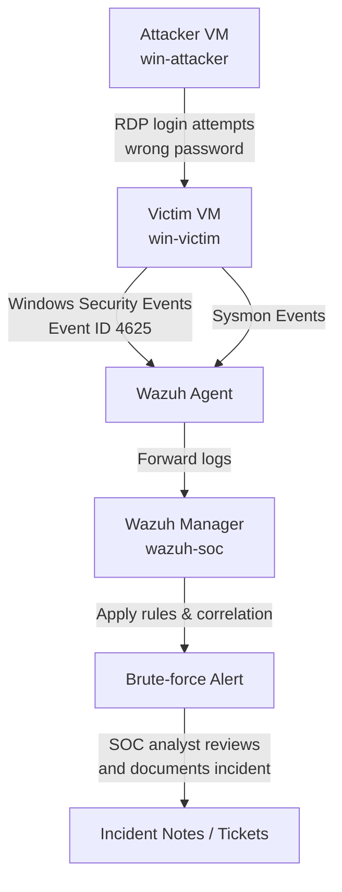

# Windows Brute-Force Detection Lab – Wazuh + Sysmon + Windows Event Logs

This repo documents a **home lab** where you simulate a **brute-force attack** against a Windows machine and detect it using:

- 🕵️ **Wazuh** (SIEM / XDR – SOC machine)  
- 💻 **Windows 10/11** (victim endpoint with Security + Sysmon logs)  
- 💣 **Attacker VM** (generates repeated failed logins over RDP)  

The goal is to learn how real brute-force attacks look in logs and how a SOC analyst can detect them.

---

## 📌 Lab Overview

We will build a **3-VM isolated lab**:

- **SOC VM** – runs Wazuh (manager + dashboard), collects logs, raises alerts  
- **Victim VM** – Windows endpoint with Sysmon + Wazuh agent, target of attack  
- **Attacker VM** – generates repeated failed logons (RDP brute-force simulation)  

All VMs live on a **host-only / internal network** (no internet exposure).

---

## 🧱 Lab Topology

Example addressing (you can change the subnet to match your environment):

| Role        | Hostname      | OS                  | IP              | Network  |
|------------|---------------|---------------------|-----------------|----------|
| SOC        | `wazuh-soc`   | Ubuntu / Wazuh OVA  | `192.168.56.10` | LabNet   |
| Victim     | `win-victim`  | Windows 10 / 11     | `192.168.56.20` | LabNet   |
| Attacker   | `win-attacker`| Windows 10 / 11     | `192.168.56.30` | LabNet   |

---

## 🗺️ Architecture Diagram (Network View)

```text
          ┌───────────────────────────────┐
          │       Host-Only Network      │  192.168.56.0/24 (LabNet)
          │                               │
   192.168.56.10                 192.168.56.20                 192.168.56.30
┌────────────────┐          ┌─────────────────┐          ┌─────────────────┐
│   Wazuh-SOC    │  <─────  │   WIN-VICTIM    │  <─────  │  WIN-ATTACKER   │
│  (Wazuh SIEM)  │  Logs    │ (Sysmon + Agent)│  RDP     │ (Brute attempts)│
└────────────────┘          └─────────────────┘          └─────────────────┘
```

---

## 🔁 Attack & Detection Flow Diagram (Step-by-Step)




---

## 🧩 Phase 0 – Hypervisor & Network Setup

1. Create a **host-only / internal network** in your hypervisor (VMware / VirtualBox / Hyper-V):
   - Name: `LabNet`
   - Subnet: `192.168.56.0/24`
   - Disable DHCP (we will use static IPs).

2. Make sure **all three VMs** use this network:
   - `wazuh-soc`
   - `win-victim`
   - `win-attacker`

---

## 🧱 Phase 1 – SOC VM (Wazuh Server)

### 1.1 Create the SOC VM

- OS: Ubuntu Server 22.04 **or** Wazuh all-in-one OVA  
- Name: `wazuh-soc`  
- NIC: connected to `LabNet`

Assign static IP inside the VM (example):

```bash
sudo nano /etc/netplan/01-netcfg.yaml
```

Example config:

```yaml
network:
  version: 2
  ethernets:
    ens33:
      dhcp4: no
      addresses:
        - 192.168.56.10/24
      nameservers:
        addresses: [1.1.1.1, 8.8.8.8]
```

Apply and verify:

```bash
sudo netplan apply
ip a
```

---

### 1.2 Install Wazuh (All-in-One)

Run on `wazuh-soc`:

```bash
curl -sO https://packages.wazuh.com/4.9/wazuh-install.sh
sudo bash ./wazuh-install.sh -a
```

> If the version changed, use the latest from Wazuh docs, but the logic is the same.

When the script finishes, note:

- Wazuh Dashboard URL (e.g. `https://192.168.56.10`)
- Username + password printed by the installer

From your host machine’s browser:

- Open `https://192.168.56.10`
- Accept self-signed certificate
- Login to confirm the dashboard works

---

## 🧱 Phase 2 – Victim VM (Windows + Sysmon + Wazuh Agent)

### 2.1 Create the Victim VM

- OS: Windows 10 / 11  
- Name: `win-victim`  
- NIC: `LabNet`

Set static IP:

- IP: `192.168.56.20`
- Mask: `255.255.255.0`
- Gateway: (optional in this lab)
- DNS: `8.8.8.8` or leave blank if offline

Create a local user:

- Username: `labuser`
- Password: `StrongPass123!`

This will be the **account targeted** in the brute-force.

---

### 2.2 Enable Security Logging & RDP

On `win-victim`:

1. Run `secpol.msc`  
2. Go to: **Local Policies → Audit Policy**
3. Make sure:
   - **Audit logon events** → Success and Failure

Enable RDP:

- Right-click **This PC** → Properties → Remote settings  
- Allow remote connections to this computer.

---

### 2.3 Install Sysmon

1. Download **Sysmon** from Microsoft Sysinternals.  
2. Download a config (e.g. SwiftOnSecurity or your own).  
3. Install Sysmon (example):

```powershell
sysmon64.exe -i sysmonconfig.xml
```

Verify:

- Open **Event Viewer** → Applications and Services Logs → Microsoft → Windows → Sysmon → Operational  
- You should see Sysmon events.

---

### 2.4 Install Wazuh Agent (Windows)

On `wazuh-soc`, add an agent entry:

```bash
sudo /var/ossec/bin/manage_agents
```

- Choose `A` → Add agent
- Name: `win-victim`
- IP: `192.168.56.20`
- Copy the generated **key**

On `win-victim`:

1. Download Wazuh Windows agent MSI from Wazuh website.  
2. Install it and during setup:
   - Manager address: `192.168.56.10`
   - Agent name: `win-victim`
   - Use the key from the manager if prompted

Or after install, run:

```cmd
"C:\Program Files (x86)\ossec-agent\agent-auth.exe" -m 192.168.56.10
```

Then:

- Start the **Wazuh Agent** service in `services.msc`.

On the Wazuh dashboard:

- Go to **Agents**
- Confirm `win-victim` appears as **Active**

---

## ⚙️ Phase 3 – Configure Log Collection in Wazuh

On `wazuh-soc`, edit the manager config:

```bash
sudo nano /var/ossec/etc/ossec.conf
```

Ensure these sections exist for Windows event channels:

```xml
<localfile>
  <log_format>eventchannel</log_format>
  <location>Security</location>
</localfile>

<localfile>
  <log_format>eventchannel</log_format>
  <location>Microsoft-Windows-Sysmon/Operational</location>
</localfile>
```

Save and restart:

```bash
sudo systemctl restart wazuh-manager
```

Now generate some random events on `win-victim` (log off/log on, open tools), then in the Wazuh dashboard:

- Go to **Security events**
- Filter by agent: `win-victim`
- You should see Security + Sysmon logs flowing in

---

## 🧱 Phase 4 – Attacker VM Setup

Create the attacker VM:

- OS: Windows 10 / 11 (*or* Kali if you prefer)
- Name: `win-attacker`
- NIC: `LabNet`
- Static IP: `192.168.56.30`

We will use it to run **RDP login attempts** against `win-victim`.

No special tools required.

---

## 💣 Phase 5 – Brute-Force Simulation (Safe & Local)

On `win-attacker`:

1. Press `Win + R`, type: `mstsc` → Enter  
2. In Remote Desktop Connection:
   - Computer: `192.168.56.20`
3. When prompted for credentials:
   - Username: `.\labuser` or `win-victim\labuser`
   - Use a **wrong password**, e.g. `WrongPass123!`

Now:

- Repeatedly try to log in with the wrong password
- Do 15–25 attempts (enough to look like a brute-force)

This will generate many **Event ID 4625 (failed logon)** entries on `win-victim`.

You can confirm in Event Viewer on the victim:

- **Windows Logs → Security → Event ID 4625**

---

## 🕵️ Phase 6 – Detecting the Attack in Wazuh

In the Wazuh dashboard:

1. Go to **Security events**
2. Filter by:
   - Agent: `win-victim`
   - Category: `windows` (optional)
3. Look for repeated **failed logon** detections.

Wazuh has built-in rules that group repeated failures from the same source/user into higher-level alerts (e.g., “multiple failed login attempts”).

Take a screenshot of:

- The raw events
- Any correlation/alert that mentions multiple failures / possible brute-force

---

## 🛠️ (Optional) Phase 7 – Custom Wazuh Brute-Force Rule

If you want to go a bit deeper, you can create a custom correlation rule.

On `wazuh-soc`:

```bash
sudo nano /var/ossec/etc/rules/local_rules.xml
```

Add something like:

```xml
<group name="windows,bruteforce,">
  <rule id="100010" level="8">
    <if_group>windows</if_group>
    <if_sid>18107</if_sid> <!-- example SID for failed logon, adjust as needed -->
    <frequency>8</frequency>
    <timeframe>120</timeframe>
    <description>Possible Windows RDP brute-force attack detected</description>
    <group>bruteforce,rdp,windows,</group>
  </rule>
</group>
```

Then:

```bash
sudo systemctl restart wazuh-manager
```

Repeat the RDP attack from `win-attacker`.

Check if rule `100010` fires under **Security events**.

---

## ✅ What to Capture (For Portfolio / GitHub / Notes)

Good screenshots / evidence:

- Wazuh dashboard showing `win-victim` as an active agent
- Event Viewer (Security log) on `win-victim` showing repeated **4625** events
- Wazuh Security Events page showing:
  - Ingested Windows events
  - Brute-force / multiple failed login alerts
- RDP failure screen on `win-attacker` (to show the simulation)

You can turn this into:

- A GitHub repo (this README)  
- A LinkedIn post  
- A small write-up for your resume under “Home Lab Projects”

---

## 🎓 Learning Outcomes

By finishing this lab, you practice:

- Building a **small SOC-style environment**  
- Installing and configuring **Wazuh**  
- Deploying **Sysmon + Wazuh agent** on Windows  
- Understanding **Windows Security logs** (especially Event ID 4625)  
- Simulating **brute-force attacks** safely  
- Detecting attacks using **log correlation rules**

This is exactly the type of practical lab that impresses **SOC / Blue Team / Security Analyst** recruiters.

---

## 🔎 Suggested Repo Name & Tags

**Repo name:**

```text
windows-bruteforce-detection-lab-wazuh
```

**Topics / tags on GitHub:**

```text
wazuh, soc, siem, windows-logs, sysmon, brute-force, homelab, blue-team, detection-engineering, security-operations
```

---

If you extend this lab later (e.g., add MITRE ATT&CK mapping, more attack types, or dashboards), you can keep updating this README and treat it as a living SOC lab project.
